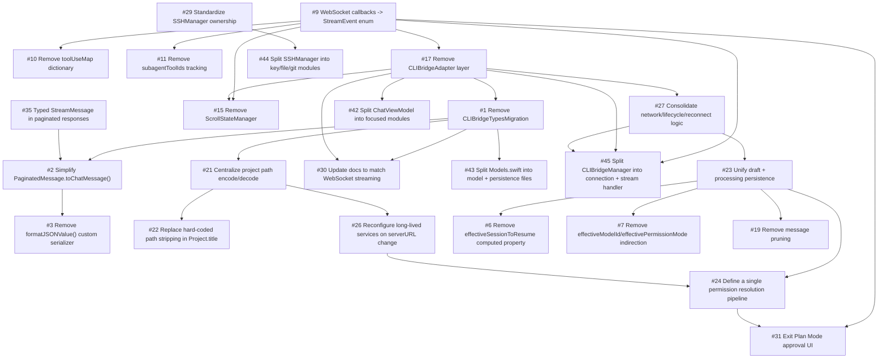

# Dependency Graph

This graph lists issue dependencies and a recommended execution order. Use it to schedule work without breaking prerequisite chains.

## Recommended Order

1. #9 WebSocket callbacks -> StreamEvent enum ✅
2. #17 Remove CLIBridgeAdapter layer ✅
3. #1 Remove CLIBridgeTypesMigration ✅
4. #27 Consolidate network/lifecycle/reconnect logic ✅
5. #23 Unify draft + processing persistence ✅
6. #25 Finish or remove MessageQueuePersistence ✅
7. #5 Consolidate stores into a single persistence layer ❌ (Won't Fix)
8. #16 Consolidate sheet booleans into activeSheet enum ✅
9. #21 Centralize project path encode/decode ✅
10. #22 Replace hard-coded path stripping in Project.title ✅
11. #26 Reconfigure long-lived services on serverURL change ✅
12. #24 Define a single permission resolution pipeline ✅
13. #30 Update docs to match WebSocket streaming ✅
14. #4 Eliminate extractFilePath() parsing ✅
15. #6 Remove effectiveSessionToResume computed property ✅
16. #7 Remove effectiveModelId/effectivePermissionMode indirection ✅
17. #8 Eliminate streamingMessageId/streamingMessageTimestamp ✅
18. #10 Remove toolUseMap dictionary ✅
19. #11 Remove subagentToolIds tracking ✅
20. #12 Remove pendingGitCommands tracking ✅
21. #13 Remove todoHideTimer auto-hide logic ✅
22. #14 Simplify git banner state ✅
23. #15 Remove ScrollStateManager ✅
24. #18 Inline groupMessagesForDisplay() ✅
25. #19 Remove message pruning ✅
26. #20 Simplify slash command handling ✅
27. #28 Gate ToolTestView/dev tools behind DEBUG ✅
28. #29 Standardize SSHManager ownership ✅
29. #31 Exit Plan Mode approval UI ✅
30. #32 Multi-repo/monorepo git status aggregation ✅
31. #33 Batch session counts API ✅
32. #34 Idempotent reconnection protocol (unblocked)
33. #35 Typed StreamMessage in paginated responses (unblocked)
34. #36 Normalize model ID handling (echo alias) (unblocked)
35. #37 Typed tool input instead of JSONValue dict (unblocked)
36. #38 Fix duplicate idle state messages (unblocked)
37. #39 Include session count in project list response (unblocked)
38. #40 Standardize ISO8601 with fractional seconds (unblocked)
39. #41 Document error responses in OpenAPI (unblocked)
40. #2 Simplify PaginatedMessage.toChatMessage() ✅
41. #3 Remove formatJSONValue() custom serializer ✅
42. #42 Split ChatViewModel into focused modules ✅
43. #43 Split Models.swift into model + persistence files ✅
44. #44 Split SSHManager into key/file/git modules ✅
45. #45 Split CLIBridgeManager into connection + stream handler ✅

## Dependency Edges

## Notes

- #5 was marked "Won't Fix" after audit found no duplication - stores are intentionally separate
- #16, #42, #43 are no longer blocked by #5 (dependencies removed)
- cli-bridge issues (#33-#41) are unblocked by feature/codebase-simplification backend work
- #15 completed - ChatView already used native ScrollViewReader; ScrollStateManager was unused indirection
- #8 was completed by converting @Published var to let/computed property (no more UUID regeneration)
