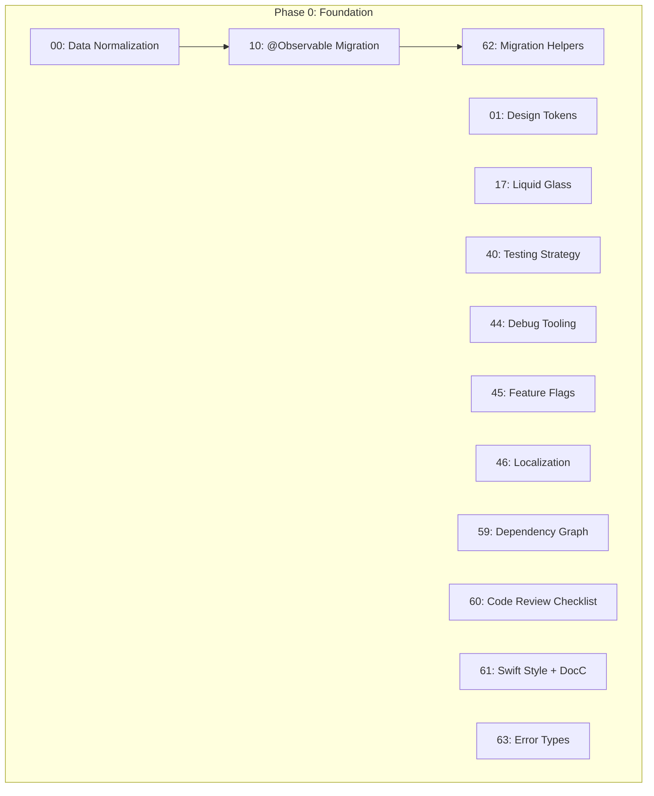
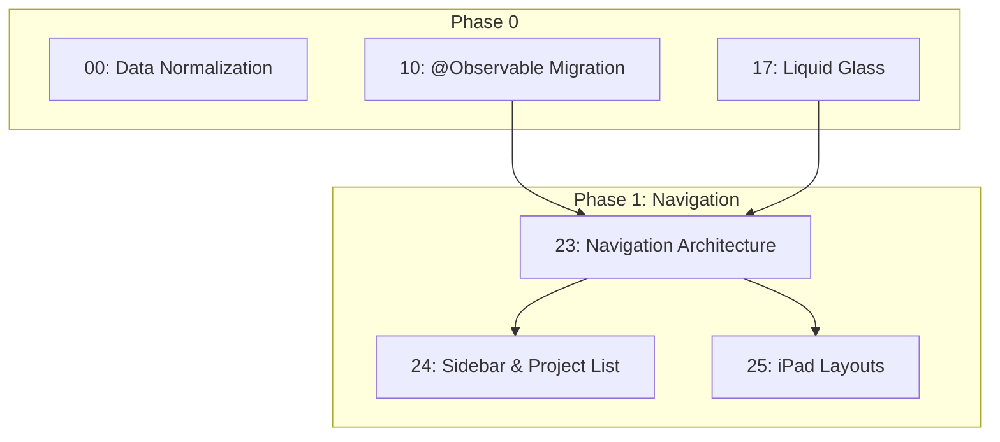
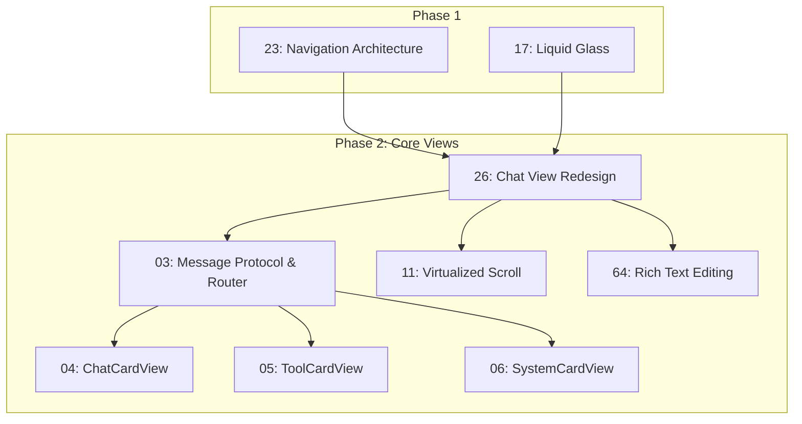
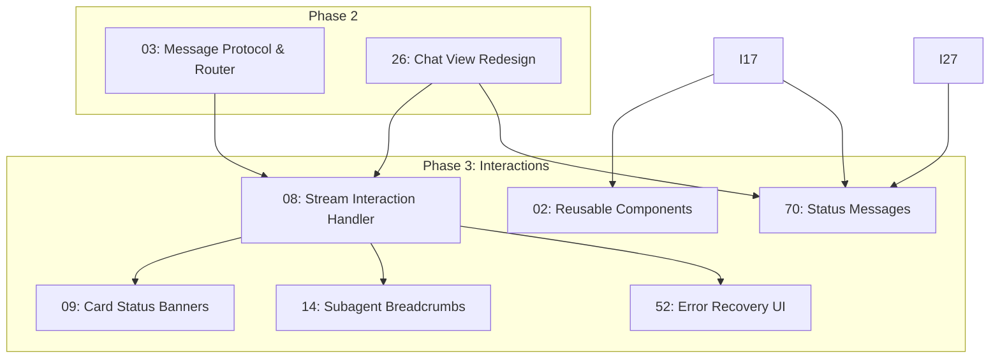
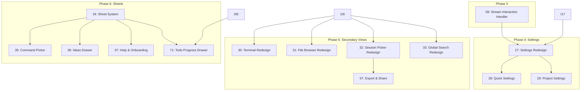
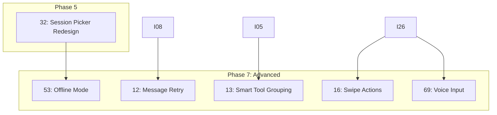
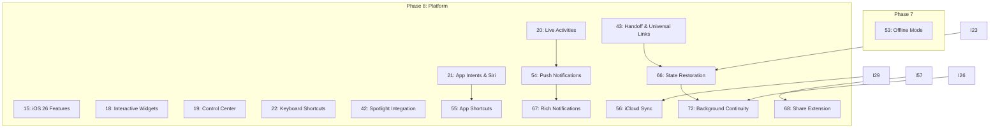
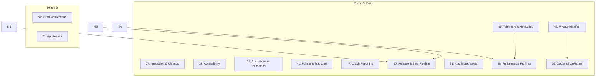
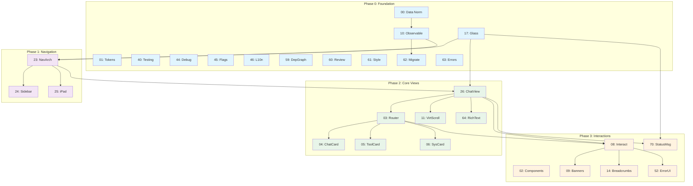

# Issue 59: Dependency Graph

**Phase:** 0 (Foundation)
**Priority:** Medium
**Status:** Not Started
**Depends On:** None
**Target:** iOS 26.2, Xcode 26.2, Swift 6.2.1

## Goal

Provide a comprehensive Mermaid dependency graph that visualizes issue dependencies for the UI redesign project. This enables understanding of critical paths, parallel work opportunities, and phase boundaries.

## Scope

- In scope:
  - Mermaid flowchart of all 73 issues
  - Dependency edges showing blocking relationships
  - Phase groupings
  - Critical path identification
- Out of scope:
  - Automated dependency validation
  - Integration with project management tools
  - Dynamic graph generation

## Non-goals

- Real-time synchronization with issue status
- Effort estimates (no time-based planning)

## Dependencies

- None (foundational issue)

## Touch Set

- Files to create:
  - `requirements/projects/ui-redesign/docs/overview/dependency-graph.md`
- Files to modify:
  - `requirements/projects/ui-redesign/README.md` (add link)

## Dependency Graph

### Phase 0: Foundation



### Phase 1: Navigation & Layout



### Phase 2: Core Views



### Phase 3: Interactions & Status



### Phase 4-6: Settings, Secondary Views, Sheets



### Phase 7: Advanced Features



### Phase 8: iOS 26 Platform



### Phase 9: Polish & Integration



### Complete Dependency Graph



## Critical Path

The critical path determines the minimum time to complete the project:

```
00 → 10 → 23 → 26 → 03 → 08 → [Phase 4+]
```

| Step | Issue | Description |
|------|-------|-------------|
| 1 | #00 | Data Normalization (enables consistent message handling) |
| 2 | #10 | @Observable Migration (enables all new state management) |
| 3 | #23 | Navigation Architecture (enables new layout) |
| 4 | #26 | Chat View Redesign (main user-facing view) |
| 5 | #03 | Message Protocol & Router (enables new cards) |
| 6 | #08 | Stream Interaction Handler (enables interactions) |

### Parallel Work Opportunities

These issues can be worked on in parallel once their dependencies are met:

| Parallel Track | Issues | Prerequisites |
|----------------|--------|---------------|
| Design System | #01, #17 | None |
| Tooling | #44, #45, #46, #59, #60, #61 | None |
| Cards | #04, #05, #06 | #03 |
| iPad | #24, #25 | #23 |
| Settings | #27, #28, #29 | #08, #17 |
| Platform | #18, #19, #20, #21, #22 | #26 |

## Issue Dependency Matrix

| Issue | Depends On | Blocks |
|-------|------------|--------|
| #00 | - | #10 |
| #01 | - | - |
| #02 | #17 | - |
| #03 | #26 | #04, #05, #06, #08 |
| #04 | #03 | - |
| #05 | #03 | #13 |
| #06 | #03 | - |
| #07 | All | - |
| #08 | #03, #26 | #09, #12, #14, #27, #52 |
| #09 | #08 | - |
| #10 | #00 | #23, #62 |
| #11 | #26 | - |
| #12 | #08 | - |
| #13 | #05 | - |
| #14 | #08 | - |
| #15 | - | - |
| #16 | #26 | - |
| #17 | - | #02, #23, #26, #27 |
| #18 | - | - |
| #19 | - | - |
| #20 | - | #54 |
| #21 | - | #55 |
| #22 | - | - |
| #23 | #10, #17 | #24, #25, #26, #66 |
| #24 | #23 | - |
| #25 | #23 | - |
| #26 | #23, #17 | #03, #08, #11, #16, #30, #31, #32, #33, #64, #69 |
| #27 | #08, #17 | #28, #29 |
| #28 | #27 | - |
| #29 | #27 | #56 |
| #30 | #26 | - |
| #31 | #26 | - |
| #32 | #26 | #53, #57 |
| #33 | #26 | - |
| #34 | - | #35, #36, #37 |
| #35 | #34 | - |
| #36 | #34 | - |
| #37 | #34 | - |
| #38 | - | - |
| #39 | - | - |
| #40 | - | #58 |
| #41 | - | - |
| #42 | - | - |
| #43 | - | #66 |
| #44 | - | #50 |
| #45 | - | #50 |
| #46 | - | - |
| #47 | - | - |
| #48 | - | #58 |
| #49 | - | #65 |
| #50 | #44, #45 | - |
| #51 | - | - |
| #52 | #08 | - |
| #53 | #32 | - |
| #54 | #20 | #67 |
| #55 | #21 | - |
| #56 | #29 | - |
| #57 | #32 | #68 |
| #58 | #40, #48 | - |
| #59 | - | - |
| #60 | - | - |
| #61 | - | - |
| #62 | #10 | - |
| #63 | - | - |
| #64 | #26 | - |
| #65 | #49 | - |
| #66 | #23, #43 | - |
| #67 | #54 | - |
| #68 | #57 | - |
| #69 | #26 | - |
| #70 | #17, #26, #27 | - |
| #71 | #05, #34 | - |
| #72 | #26, #66 | - |

## Acceptance Criteria

- [ ] Complete Mermaid graph with all 73 issues
- [ ] Dependency edges accurately reflect issue specs
- [ ] Critical path identified
- [ ] Parallel work opportunities documented
- [ ] Dependency matrix for quick reference
- [ ] Graph renders correctly in GitHub/GitLab

## Testing

Manual: Verify graph renders in VS Code Mermaid preview and GitHub markdown.
